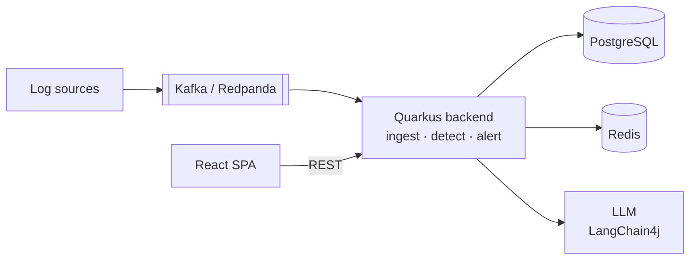

# ai-siem-logs-analyzer

AI-assisted SIEM log analysis platform.

## Quick start

Three commands, from a fresh clone to a running API with live reload:

```bash
make hooks                          # once per clone: install the format/lint pre-commit hook
make up                             # PostgreSQL + Redis + Redpanda, healthchecked
cd backend && ./mvnw quarkus:dev    # API on http://localhost:8080, live reload
```

`make up` writes `docker/.env` from the example on first run and blocks until every
healthcheck is green, so the third command finds its database already up. Dev mode needs a
JDK 21 on the host; without one, `make up-app` runs the backend in a container instead.

Set the administrator's password on first run and sign in:

```bash
APP_AUTH_BOOTSTRAP_PASSWORD='choose-something-long' ./mvnw quarkus:dev
curl -s -X POST localhost:8080/api/auth/login \
  -H 'Content-Type: application/json' \
  -d '{"username":"admin","password":"choose-something-long"}'
```

Every other endpoint expects the `accessToken` from that response as
`Authorization: Bearer <token>`.

Check it: <http://localhost:8080/q/health> · Swagger UI at
<http://localhost:8080/q/swagger-ui>.

## Architecture



Components, data model, runtime flows and the open decisions:
[docs/ARCHITECTURE.md](docs/ARCHITECTURE.md).

## Monorepo layout

| Path        | What                                              |
|-------------|---------------------------------------------------|
| `backend/`  | Quarkus (Java 21) REST API — see [backend/README.md](backend/README.md) |
| `frontend/` | React + Vite + TypeScript UI — see [frontend/README.md](frontend/README.md) |
| `docker/`   | Local dev stack (Compose) — see [docker/README.md](docker/README.md) |
| `docs/`     | Architecture & docs — see [docs/ARCHITECTURE.md](docs/ARCHITECTURE.md) |

## Stack

**Backend:** Quarkus (Java 21) · Quarkus REST + Jackson · Hibernate ORM Panache · Flyway · Hibernate Validator · SmallRye JWT (RBAC `@RolesAllowed`) · SmallRye Reactive Messaging + Kafka (Redpanda) · Quarkus Redis · LangChain4j · Smile · Maven · JUnit 5 + RestAssured + Testcontainers + JaCoCo

**Frontend:** React + Vite + TypeScript · TanStack Query · shadcn/ui + Tailwind · Apache ECharts · OpenAPI-generated type-safe client · Vitest + Playwright

**Storage:** PostgreSQL · Redis · Kafka (Redpanda) · OpenSearch (decision pending)

## Local development

```bash
make up      # PostgreSQL + Redis + Redpanda, healthchecked, persistent volumes
make up-app  # the same, plus the backend API on :8080 (no host JDK needed)
make verify  # run the backend build exactly as CI does (Temurin 21, in a container)
make down    # remove containers, keep volumes — `make reset` drops the data too
```

Details, ports and connection settings: [docker/README.md](docker/README.md).

## Format & lint

| Area       | Formatter                             | Linter                        |
|------------|---------------------------------------|-------------------------------|
| `backend/` | Spotless (google-java-format, AOSP)   | Checkstyle                    |
| `frontend/`| Prettier                              | ESLint (flat config)          |

The two never overlap: the formatter owns layout, the linter owns everything layout cannot
express. Checkstyle's rules are in [`backend/config/checkstyle/checkstyle.xml`](backend/config/checkstyle/checkstyle.xml);
ESLint ends its chain with `eslint-config-prettier`, which switches off every rule that
would argue with Prettier.

### On commit

```bash
make hooks   # once per clone: points core.hooksPath at .githooks/
```

[`.githooks/pre-commit`](.githooks/pre-commit) then formats and lints **only the staged
files**, and re-stages what it changed — Spotless + Checkstyle for Java, Prettier + ESLint
for the frontend. A commit fails if a linter still reports a violation afterwards, or if a
reformatted file also carried unstaged changes (those are left out of the index rather than
silently swept in). Skip the hook for one commit with `git commit --no-verify`.

The frontend step needs `frontend/node_modules`; run `pnpm install` in `frontend/` first.
The Java step prefers a JDK 21 via `/usr/libexec/java_home` — google-java-format does not
run on JDK 22+.

### By hand

```bash
make format   # rewrite: Spotless + Prettier
make lint     # read-only: Spotless, Checkstyle, ESLint, Prettier, tsc — what CI runs
```

Per area: `format-backend`, `lint-backend` (both inside the Temurin 21 container, so no JDK
is needed on the host), `format-frontend`, `lint-frontend` (these install
`frontend/node_modules` on first use). Or directly:

```bash
cd backend  && ./mvnw spotless:apply checkstyle:check
cd frontend && pnpm format && pnpm lint && pnpm typecheck
```

[`.editorconfig`](.editorconfig) mirrors both formatters, so an editor that honours it
produces files the hook has nothing to change. [`.gitattributes`](.gitattributes) pins LF
everywhere (except the Windows Maven launcher), which is what Prettier's `endOfLine: lf`
and Spotless both assume.

CI enforces the same checks, so nothing depends on the hook being installed.

## Workflow

- `main` is protected — no direct pushes.
- All changes via Pull Request, **min. 1 review** required.
- Both CI workflows (`ci-backend`, `ci-frontend`) run on **every** PR — no `paths`
  filter, so a required check never hangs on a PR that skipped it. CodeQL scans as well.
- `ci-backend`: Spotless, Checkstyle, then `./mvnw verify` (JUnit 5 + Testcontainers).
- `ci-frontend`: ESLint, Prettier, then `tsc --noEmit`.
- CI re-checks formatting and linting; the commit hook only saves you the round trip.

> The backend includes health checks, OpenAPI documentation, and a PostgreSQL persistence
> layer (Panache entities and repositories over a Flyway-managed schema); REST resources
> and ingestion land in later PRs. The frontend carries only its tooling configuration
> so far — the Vite application scaffold lands in a later PR.
