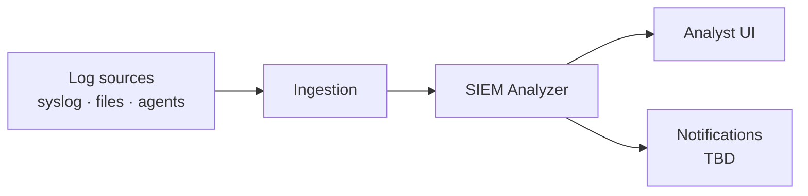
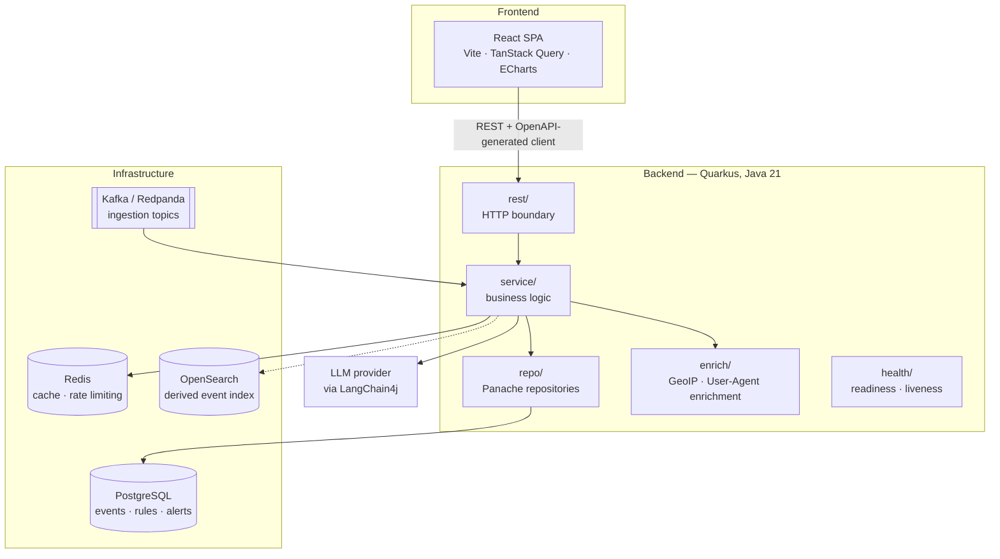
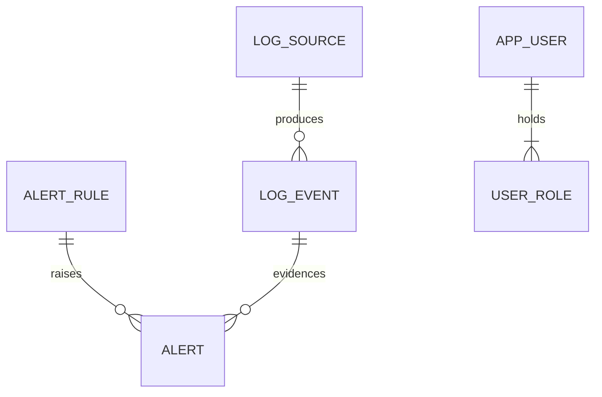

# Architecture

> **Skeleton.** This document describes the target architecture and marks what is already
> in place. Sections tagged **TBD** are decisions that have not been made yet; sections
> tagged **Planned** are decided but not implemented. Nothing here is binding until the
> corresponding PR lands — update this file in the same PR that changes the shape of the
> system.

## Status at a glance

| Area                                    | State       |
|-----------------------------------------|-------------|
| Local dev stack (Postgres/Redis/Redpanda) | Shipped     |
| Backend skeleton, health, OpenAPI         | Shipped     |
| PostgreSQL schema + Panache repositories  | Shipped     |
| Ingestion pipeline (Kafka)                | Shipped     |
| Detection (rules + AI)                    | Planned     |
| Accounts + roles (`app_user`, `user_role`) | Shipped     |
| REST API surface                          | Planned     |
| Frontend application                      | In progress |
| AuthN/AuthZ (JWT + RBAC)                  | Shipped     |
| Log search backend (OpenSearch)           | Shipped     |

## Context

The platform ingests logs from heterogeneous sources, normalises them into a common event
shape, evaluates them against detection rules and AI models, and raises alerts that an
analyst triages through a web UI.

## Component view

### Backend packages

Mirrors `com.siem.analyzer` — see [backend/README.md](../backend/README.md#package-layout).

| Package   | Responsibility                                              |
|-----------|-------------------------------------------------------------|
| `rest`    | HTTP boundary: resources, DTOs, exception mappers            |
| `service` | Business logic; the only layer that orchestrates             |
| `domain`  | JPA entities and domain enums                                |
| `repo`    | Panache repositories — every query lives here                |
| `search`  | The derived OpenSearch index — projection, queries and backfill |
| `enrich`  | GeoIP enrichment of a source address (`GeoIpEnricher` seam, MaxMind GeoLite2 lookup) and User-Agent classification (`UserAgentEnricher` seam, Yauaa) |
| `config`  | Typed `@ConfigMapping` configuration                         |
| `health`  | Custom health checks                                         |

The dependency direction is one-way: `rest → service → repo → domain`, and `rest → service →
search` alongside it. A resource never touches a repository, and a repository never returns a
DTO. The `search` package never calls back into `rest` or `service`.

## Data model

Shipped in `V1__init.sql` and `V2__users.sql`, Flyway-owned; Hibernate runs in `validate`
mode and never emits DDL.

| Table        | Holds                                                                    |
|--------------|--------------------------------------------------------------------------|
| `log_source` | Registered sources (name, type, configuration)                            |
| `log_event`  | Normalised events; carries the upstream identifier used to drop replays   |
| `log_event_index_state` | Which events have reached the search index; absence of a row is the backlog |
| `alert_rule` | Detection rules                                                           |
| `alert`      | Raised alerts; the rule is nullable — a model-raised alert has none       |
| `app_user`   | Accounts; stores an Argon2id hash, never a password                       |
| `user_role`  | Roles per account (`ADMIN`, `ANALYST`, `VIEWER`); an account may hold several |

`log_event.payload` is a JSON map keyed by the component names of `NormalizedEvent` — `format`,
`host`, `srcIp`, `srcPort`, `user`, `method`, `path`, `protocol`, `status`, `bytes`, `referrer`,
`userAgent`, and whatever a parser could not place, nested under `attributes`. GeoIP enrichment
(see Cross-cutting concerns below) adds `geoCountryIso`, `geoCountryName`, `geoCity`,
`geoLocation` (a `{lat, lon}` map), `geoAsn` and `geoAsOrg` alongside them when the event's
`srcIp` resolves to a public address the databases know. User-Agent classification adds
`uaBrowser`, `uaBrowserVersion`, `uaOs`, `uaOsVersion`, `uaDeviceClass`, `uaAgentClass` and the
boolean `uaBot` when the event carries a `userAgent`. These payload keys are camelCase; the
OpenSearch document they are projected into uses snake_case for the same fields (`geo_country_iso`
… `geo_as_org`, `geo_location` as a `geo_point`, `ua_browser` … `ua_bot`) — see Search below.

## Runtime flows

**Ingestion (Producer, consumer and access-log parser shipped; file parsing planned).** An accepted upload is
stored, its metadata row is persisted, and `LogIngestProducer` publishes a JSON
`LogIngestEvent` on the `logs.ingest` channel (SmallRye Reactive Messaging, `smallrye-kafka`
connector, topic `logs.ingest`) once the enclosing transaction commits. `LogIngestConsumer`
reads the same topic on the `logs.ingest-in` channel — a second channel name on one topic,
because SmallRye would otherwise wire the outgoing channel straight into an incoming channel
of the same name and skip the broker. The consumer runs `@Blocking`, moves the upload to
`PROCESSING`, and hands the event to a `LogFileParser`. Every message is acknowledged: a
batch that cannot be handled is recorded as `FAILED` with its reason on its own row, and a
redelivered batch whose upload is already past `PENDING` is skipped rather than parsed twice.
The broker is Redpanda in the Compose stack; the test suite swaps both connectors for
`smallrye-in-memory`, so channels and payloads are exercised without a broker. Line parsers
live in `com.siem.analyzer.parse` and turn one line into a `NormalizedEvent`.
`AccessLogParser` reads Apache and Nginx Common and Combined Log Format with a java-grok
expression (`LogFormat.ACCESS_LOG`). `SyslogParser` reads RFC 5424 and BSD / RFC 3164 syslog
(`LogFormat.SYSLOG`): rsyslog files with or without a priority, the RFC 3339 high-precision
file format, and Cisco IOS / ASA lines; a year-less BSD timestamp takes the current year, or
last year when that would put it in the future. `JsonLogParser` reads one JSON object per line
with Jackson (`LogFormat.JSON`). Which key feeds which field comes from `JsonFieldMapping`,
configured under `app.parse.json.fields.*`: each field has an ordered list of dot-separated
paths that match nested objects and flat dotted keys alike, with defaults for ECS, nginx
`escape=json`, pino/bunyan, Python JSON loggers and Docker `json-file`. Unmapped keys are kept,
nested, in the event's attributes. Lines with repeated keys, trailing content or more than 64
levels of nesting are refused. Format detection supports access logs (`ACCESS_LOG`),
syslog, JSON, and fallback to plain text. `DefaultLogFileParser` reads the stored file line by line
through those parsers, normalises into `log_event` batches, enriches each event's payload with
GeoIP data for its `srcIp` and a classification of its `userAgent` (see below), indexes them via `EventIndexer.indexAfterCommit` into
OpenSearch, and calls `markIngested`. Deduplication uses the upstream identifier. Ordering
guarantees, partitioning key and retention are **TBD**.

**GeoIP enrichment (Shipped).** `com.siem.analyzer.enrich` looks up an event's `srcIp` and, when
the address is public and one of the bundled GeoLite2 databases (City, ASN) knows it, writes
`geoCountryIso`, `geoCountryName`, `geoCity`, `geoLocation`, `geoAsn` and `geoAsOrg` onto the
payload before it is persisted — the same step described just above, not a separate consumer.
`GeoIpEnricher` is the seam; `MaxMindGeoIpEnricher` is the production implementation, reading
`GeoLite2-City.mmdb` and `GeoLite2-ASN.mmdb` from `app.geoip.city-database-path` /
`asn-database-path` (default `/opt/geoip/`) and refusing to boot in `%prod` if either file is
missing. Private, loopback and link-local networks are skipped before they ever reach the
database — a lookup on internal traffic has nothing useful to say. `app.geoip.enabled=false`
under `%test`, so tests substitute a `StubGeoIpEnricher` CDI mock instead of shipping real
database fixtures into every test run. Enrichment happens once, at ingestion time, rather than
on every read: a search hit's geo fields come straight out of the index with no per-request
lookup, and re-enriching each read would repeat the same MaxMind lookup for an address that
does not move between requests. The databases ship inside the container image (`src/main/jib`,
fetched from MaxMind during CI) rather than being downloaded per event or per boot, because a
GeoLite2 database is tens of megabytes, changes on MaxMind's own release cadence rather than
per deploy, and a missing network path to MaxMind at request time must never be how a log
search endpoint degrades.

**User-Agent classification (Shipped).** In the same step, `UserAgentEnricher` classifies the
event's `userAgent` and writes `uaBrowser`, `uaBrowserVersion`, `uaOs`, `uaOsVersion`,
`uaDeviceClass`, `uaAgentClass` and `uaBot` onto the payload. `YauaaUserAgentEnricher` is the
production implementation, built on [Yauaa](https://yauaa.basjes.nl/): its rule set ships inside
the library jar, so unlike GeoIP there is nothing to download, bundle or refresh — a Yauaa upgrade
is how knowledge of new browsers and crawlers arrives. The analyzer is built once at start-up
(about three seconds, restricted to the six fields read) and caches the last
`app.user-agent.cache-size` headers (default 10000), since real traffic repeats a small set of
them. `uaBot` is true for Yauaa's `Robot`, `Robot Mobile`, `Robot Imitator`, `Cloud Application`
and `Hacker` classes. Crawlers, command-line tools and HTTP libraries (curl, wget,
python-requests) and headless browsers all fall in those classes. A `Hacker` header — an injection
payload, a scanner signature such as sqlmap or Nmap, or a value no real client sends — keeps
`Hacker` in the two class fields only, so it never shows up as a browser or operating system
name. A value Yauaa does not know (`Unknown`, `??`) writes no key, and `-` (an access log's "no
header") is not classified at all. `app.user-agent.enabled=false` under `%test`, where a
`StubUserAgentEnricher` stands in so no test boot pays for the rule engine;
`YauaaUserAgentEnricherTest` runs the real one. Yauaa logs through the Log4j 2 API, which
`log4j2-jboss-logmanager` routes into the Quarkus log.

**Search (Shipped).** `log_event` is projected into an OpenSearch index addressed through the
`log-events` alias, described in [ADR 0001](adr/0001-log-search-backend.md). The index is
derived and never authoritative: PostgreSQL keeps `raw` and `payload`, and the index can be
rebuilt from them at any time. `SearchIndexInitializer` creates the index and alias at start-up
from `opensearch/log-events-mapping.json`, whose mapping is `dynamic: strict` — `message` is
`text` with a `keyword` subfield, `raw` is `wildcard` for substring matching, `src_ip` is `ip`
with `ignore_malformed`, and anything a parser could not place goes to `attributes` as a
`flat_object`, which is searchable but not efficiently aggregatable. A field the UI facets on
must therefore be mapped explicitly. `EventIndexer` writes documents under the event's own
identifier, so a redelivered batch overwrites rather than duplicating, and records the write in
`log_event_index_state`. `SearchIndexInitializer` also pushes any new mapping properties onto an
already-existing index at start-up, so a shipped mapping change (such as the geo fields) reaches
a running deployment without a manual reindex. What guarantees an event becomes searchable is
`SearchBackfillJob`, which drains the anti-join on a schedule; `indexAfterCommit` only shortens
the wait and, like `LogIngestProducer`, fires after the transaction commits. An engine that is
down degrades search and never blocks ingestion: the write is skipped, the event stays in the
backlog, and readiness is unaffected — `quarkus.elasticsearch.health.enabled` is `false` and
`SearchIndexHealthCheck` reports the engine's state as data instead. That check (`search-index`)
always answers UP and carries a `mapping` data entry of `current` or `outdated`, so a stuck
mapping push shows up as data on an otherwise-healthy check rather than as a failed readiness
probe. `GET /api/events/search` is open to every signed-in role and answers 503, not an empty
page, when the index cannot be
reached. It filters by time, source, severity, source IP (address or CIDR) and HTTP status
(code or class such as `5xx`). It sorts by event time in either direction and pages by
`search_after` cursor, never by offset. A hit does not carry the parsed fields — `srcIp`,
`userAgent`, the `geo*` and `ua*` fields, and so on — as top-level properties; they surface
generically through its `fields` map (`OpenSearchEventSearch.toHit`), converted back from the
index's snake_case to the payload's own camelCase key names (`fields.geoCountryIso`,
`fields.geoAsn`, `fields.uaBot`, …), with numbers and booleans keeping their JSON type. Its contract is documented in `/q/openapi`.

**Detection (Planned).** Rule evaluation over incoming events, plus AI-assisted detection
through LangChain4j and anomaly scoring with Smile. Whether detection runs inline with
ingestion or as a separate consumer is **TBD**.

**Triage (Planned).** The SPA reads alerts and events over REST, an analyst changes an
alert's status, and the transition is audited.

## Cross-cutting concerns

- **AuthN/AuthZ (Shipped).** `POST /api/auth/login` exchanges a username and password for an
  RS256 access token (15 minutes, carrying `sub`, `upn` and the account's roles as `groups`) and
  an opaque refresh token held in Redis. `@RolesAllowed` reads the roles straight off the token,
  and `quarkus.security.jaxrs.deny-unannotated-endpoints` refuses any endpoint that forgot to
  say who may call it. Refresh rotates: a token is spent once, and one presented twice revokes
  every session of that account. Logout is immediate — the access token's `jti` goes onto a
  Redis deny-list for the rest of its life — and every attempt lands in `auth_event`.
  Multi-tenancy remains **TBD**.
- **Roles per endpoint (Shipped).** Authorization is decided server-side on every endpoint;
  the SPA hides what a role cannot use, but hiding is not enforcing. Roles are declared per
  method rather than per resource class, so a method added later inherits nothing and is
  refused until someone states its rule. `/api/users` reads (`GET` on the collection and on
  one account) are open to `ADMIN`, `ANALYST` and `VIEWER`; every write — create, update,
  password reset, delete — is `ADMIN` alone. `/api/auth/login` and `/api/auth/refresh` are
  open by necessity, `/api/auth/logout` and `/api/auth/me` need any signed-in account.
  Opening the reads was a deliberate trade: any account can now enumerate usernames, e-mail
  addresses and roles, accepted because triage needs to know who owns an alert and bounded
  by what `UserResponse` carries. `UserResourceSecurityTest` and `AuthResourceSecurityTest`
  assert the whole matrix per role, `RbacJwtTest` repeats the key cases over a real token to
  prove the `groups` claim reaches the role check, and `EndpointAuthorizationCoverageTest`
  scans the compiled resources so an unannotated endpoint fails the build rather than
  answering `403` to everyone in production.
- **Credentials.** Argon2id (password4j), cost configured under `app.security.argon2`. The
  parameters are stored inside each hash, so raising them leaves existing accounts able to
  sign in. `V2__users.sql` seeds an `admin` account whose hash is the locked marker `!`,
  which matches no password — a deployment sets one through `APP_AUTH_BOOTSTRAP_PASSWORD` at
  start-up rather than inheriting a credential that would be identical everywhere.
- **Configuration.** `application.yaml` with MicroProfile Config profiles and typed
  `@ConfigMapping` interfaces. No configuration is read as loose strings.
- **Observability.** Health endpoints under `/q/health` today. Metrics and tracing are
  **TBD**.
- **API contract.** The OpenAPI document generated at `/q/openapi` is the source of truth;
  the frontend client is generated from it, so the contract cannot drift silently.
- **Errors.** Exception mapping and a common error payload shape are **TBD**.

## Decision log

Architecture decisions get one entry each, newest first. Anything marked TBD above becomes
an entry here once decided; substantial ones graduate to an ADR under `docs/adr/`.

| Date | Decision | Rationale |
|------|----------|-----------|
| 2026-09-24 | User-Agent classification uses Yauaa at ingestion time, and counts command-line tools, HTTP libraries, headless browsers and attack payloads as bots | Yauaa's rules ship inside the jar, so it adds no data file to fetch or bundle, and it classifies robots and hacking attempts, not only browsers. For a SIEM, "not a person at a browser" is the useful meaning of bot, and curl or sqlmap in a header is as automated as Googlebot |
| 2026-09-22 | GeoIP enrichment runs at ingestion time, writing geo fields onto the event payload, rather than at read time; the GeoLite2 databases are bundled into the container image rather than fetched per event | A search hit is read far more often than an event is ingested, so resolving `srcIp` once and storing the result avoids repeating the same MaxMind lookup on every page view; bundling the databases keeps a missing network path to MaxMind from ever being how the search endpoint degrades, at the cost of a larger image and a database that ages until the next deploy |
| 2026-09-15 | Log search runs on OpenSearch as a derived index; PostgreSQL stays the system of record — [ADR 0001](adr/0001-log-search-backend.md) | Aggregations and facets for the analyst dashboard are what PostgreSQL alone answers expensively; keeping the index derived means a failed index is a stale read, never lost data |

Open questions carried by this document: detection placement, ordering and retention on the
ingestion topics, tenancy model, and the error contract.
