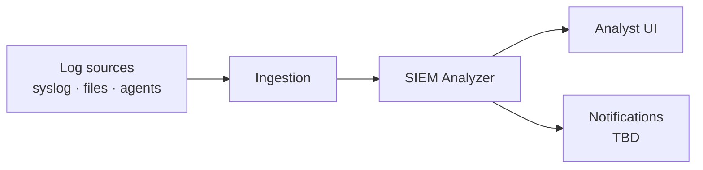
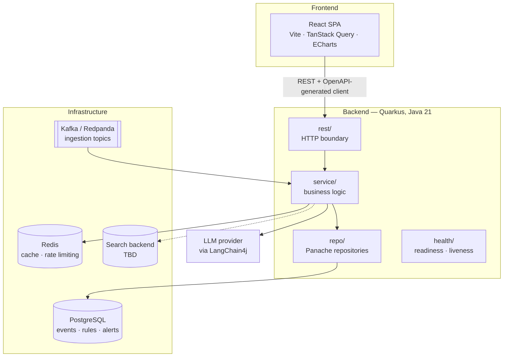
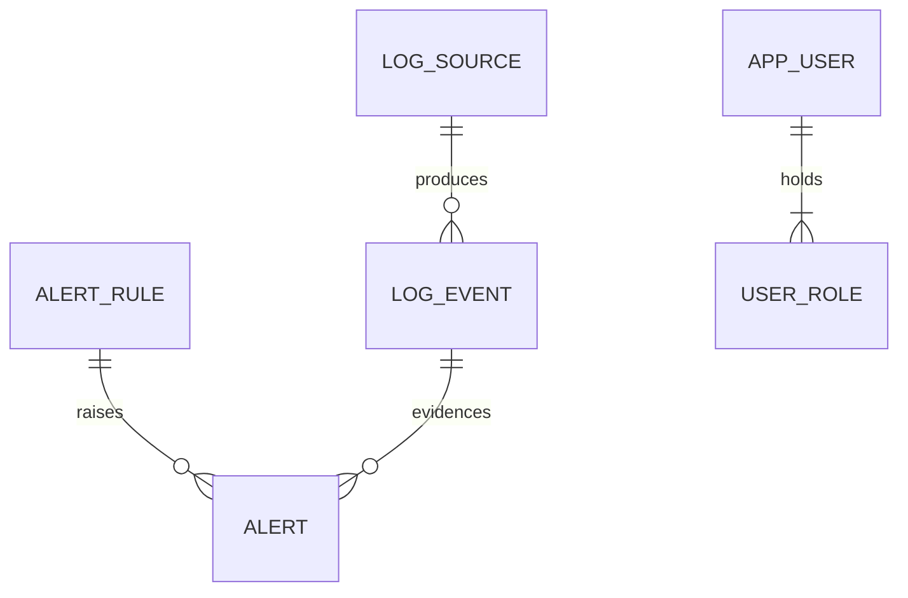

# Architecture

> **Skeleton.** This document describes the target architecture and marks what is already
> in place. Sections tagged **TBD** are decisions that have not been made yet; sections
> tagged **Planned** are decided but not implemented. Nothing here is binding until the
> corresponding PR lands — update this file in the same PR that changes the shape of the
> system.

## Status at a glance

| Area                                    | State       |
|-----------------------------------------|-------------|
| Local dev stack (Postgres/Redis/Redpanda) | Shipped     |
| Backend skeleton, health, OpenAPI         | Shipped     |
| PostgreSQL schema + Panache repositories  | Shipped     |
| Ingestion pipeline (Kafka)                | Producer, consumer and access-log parser shipped; file parsing planned |
| Detection (rules + AI)                    | Planned     |
| Accounts + roles (`app_user`, `user_role`) | Shipped     |
| REST API surface                          | Planned     |
| Frontend application                      | Planned     |
| AuthN/AuthZ (JWT + RBAC)                  | Shipped     |
| Log search backend (OpenSearch?)          | TBD         |

## Context

The platform ingests logs from heterogeneous sources, normalises them into a common event
shape, evaluates them against detection rules and AI models, and raises alerts that an
analyst triages through a web UI.

## Component view

### Backend packages

Mirrors `com.siem.analyzer` — see [backend/README.md](../backend/README.md#package-layout).

| Package   | Responsibility                                              |
|-----------|-------------------------------------------------------------|
| `rest`    | HTTP boundary: resources, DTOs, exception mappers            |
| `service` | Business logic; the only layer that orchestrates             |
| `domain`  | JPA entities and domain enums                                |
| `repo`    | Panache repositories — every query lives here                |
| `config`  | Typed `@ConfigMapping` configuration                         |
| `health`  | Custom health checks                                         |

The dependency direction is one-way: `rest → service → repo → domain`. A resource never
touches a repository, and a repository never returns a DTO.

## Data model

Shipped in `V1__init.sql` and `V2__users.sql`, Flyway-owned; Hibernate runs in `validate`
mode and never emits DDL.

| Table        | Holds                                                                    |
|--------------|--------------------------------------------------------------------------|
| `log_source` | Registered sources (name, type, configuration)                            |
| `log_event`  | Normalised events; carries the upstream identifier used to drop replays   |
| `alert_rule` | Detection rules                                                           |
| `alert`      | Raised alerts; the rule is nullable — a model-raised alert has none       |
| `app_user`   | Accounts; stores an Argon2id hash, never a password                       |
| `user_role`  | Roles per account (`ADMIN`, `ANALYST`, `VIEWER`); an account may hold several |

## Runtime flows

**Ingestion (Producer, consumer and access-log parser shipped; file parsing planned).** An accepted upload is
stored, its metadata row is persisted, and `LogIngestProducer` publishes a JSON
`LogIngestEvent` on the `logs.ingest` channel (SmallRye Reactive Messaging, `smallrye-kafka`
connector, topic `logs.ingest`) once the enclosing transaction commits. `LogIngestConsumer`
reads the same topic on the `logs.ingest-in` channel — a second channel name on one topic,
because SmallRye would otherwise wire the outgoing channel straight into an incoming channel
of the same name and skip the broker. The consumer runs `@Blocking`, moves the upload to
`PROCESSING`, and hands the event to a `LogFileParser`. Every message is acknowledged: a
batch that cannot be handled is recorded as `FAILED` with its reason on its own row, and a
redelivered batch whose upload is already past `PENDING` is skipped rather than parsed twice.
The broker is Redpanda in the Compose stack; the test suite swaps both connectors for
`smallrye-in-memory`, so channels and payloads are exercised without a broker. Line parsers
live in `com.siem.analyzer.parse` and turn one line into a `NormalizedEvent`.
`AccessLogParser` reads Apache and Nginx Common and Combined Log Format with a java-grok
expression (`LogFormat.ACCESS_LOG`). `SyslogParser` reads RFC 5424 and BSD / RFC 3164 syslog
(`LogFormat.SYSLOG`): rsyslog files with or without a priority, the RFC 3339 high-precision
file format, and Cisco IOS / ASA lines; a year-less BSD timestamp takes the current year, or
last year when that would put it in the future. `JsonLogParser` reads one JSON object per line
with Jackson (`LogFormat.JSON`). Which key feeds which field comes from `JsonFieldMapping`,
configured under `app.parse.json.fields.*`: each field has an ordered list of dot-separated
paths that match nested objects and flat dotted keys alike, with defaults for ECS, nginx
`escape=json`, pino/bunyan, Python JSON loggers and Docker `json-file`. Unmapped keys are kept,
nested, in the event's attributes. Lines with repeated keys, trailing content or more than 64
levels of nesting are refused. Still to come: format detection for access
logs, and a `LogFileParser` that reads the stored file line by line through those parsers,
normalises into `log_event` and calls `markIngested` — `PendingLogFileParser` currently
leaves the batch in `PROCESSING`.
Deduplication uses the upstream identifier. Ordering guarantees, partitioning key and
retention are **TBD**.

**Detection (Planned).** Rule evaluation over incoming events, plus AI-assisted detection
through LangChain4j and anomaly scoring with Smile. Whether detection runs inline with
ingestion or as a separate consumer is **TBD**.

**Triage (Planned).** The SPA reads alerts and events over REST, an analyst changes an
alert's status, and the transition is audited.

## Cross-cutting concerns

- **AuthN/AuthZ (Shipped).** `POST /api/auth/login` exchanges a username and password for an
  RS256 access token (15 minutes, carrying `sub`, `upn` and the account's roles as `groups`) and
  an opaque refresh token held in Redis. `@RolesAllowed` reads the roles straight off the token,
  and `quarkus.security.jaxrs.deny-unannotated-endpoints` refuses any endpoint that forgot to
  say who may call it. Refresh rotates: a token is spent once, and one presented twice revokes
  every session of that account. Logout is immediate — the access token's `jti` goes onto a
  Redis deny-list for the rest of its life — and every attempt lands in `auth_event`.
  Multi-tenancy remains **TBD**.
- **Roles per endpoint (Shipped).** Authorization is decided server-side on every endpoint;
  the SPA hides what a role cannot use, but hiding is not enforcing. Roles are declared per
  method rather than per resource class, so a method added later inherits nothing and is
  refused until someone states its rule. `/api/users` reads (`GET` on the collection and on
  one account) are open to `ADMIN`, `ANALYST` and `VIEWER`; every write — create, update,
  password reset, delete — is `ADMIN` alone. `/api/auth/login` and `/api/auth/refresh` are
  open by necessity, `/api/auth/logout` and `/api/auth/me` need any signed-in account.
  Opening the reads was a deliberate trade: any account can now enumerate usernames, e-mail
  addresses and roles, accepted because triage needs to know who owns an alert and bounded
  by what `UserResponse` carries. `UserResourceSecurityTest` and `AuthResourceSecurityTest`
  assert the whole matrix per role, `RbacJwtTest` repeats the key cases over a real token to
  prove the `groups` claim reaches the role check, and `EndpointAuthorizationCoverageTest`
  scans the compiled resources so an unannotated endpoint fails the build rather than
  answering `403` to everyone in production.
- **Credentials.** Argon2id (password4j), cost configured under `app.security.argon2`. The
  parameters are stored inside each hash, so raising them leaves existing accounts able to
  sign in. `V2__users.sql` seeds an `admin` account whose hash is the locked marker `!`,
  which matches no password — a deployment sets one through `APP_AUTH_BOOTSTRAP_PASSWORD` at
  start-up rather than inheriting a credential that would be identical everywhere.
- **Configuration.** `application.yaml` with MicroProfile Config profiles and typed
  `@ConfigMapping` interfaces. No configuration is read as loose strings.
- **Observability.** Health endpoints under `/q/health` today. Metrics and tracing are
  **TBD**.
- **API contract.** The OpenAPI document generated at `/q/openapi` is the source of truth;
  the frontend client is generated from it, so the contract cannot drift silently.
- **Errors.** Exception mapping and a common error payload shape are **TBD**.

## Decision log

Architecture decisions get one entry each, newest first. Anything marked TBD above becomes
an entry here once decided; substantial ones graduate to an ADR under `docs/adr/`.

| Date | Decision | Rationale |
|------|----------|-----------|
| —    | _No entries yet._ | |

Open questions carried by this document: the search backend (OpenSearch vs. PostgreSQL
full-text), detection placement, ordering and retention on the ingestion topics, tenancy
model, and the error contract.
