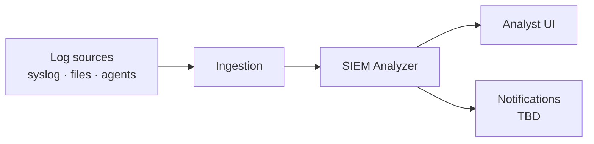
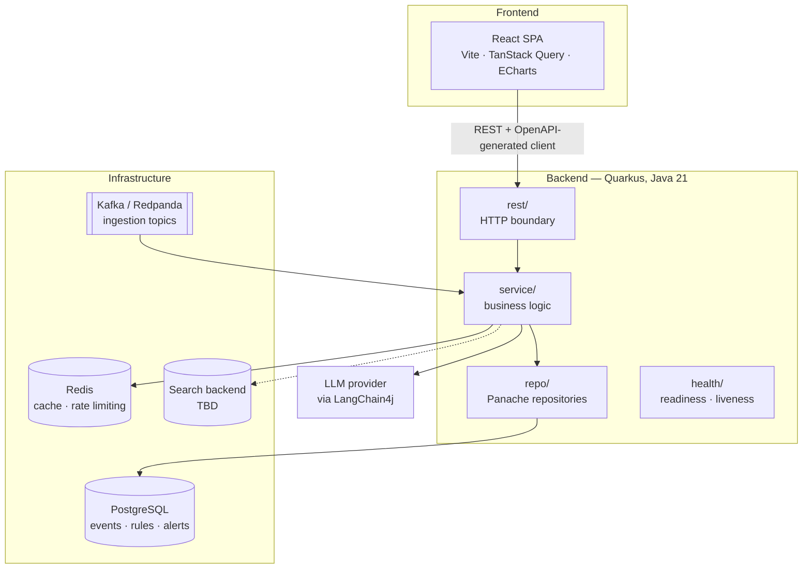
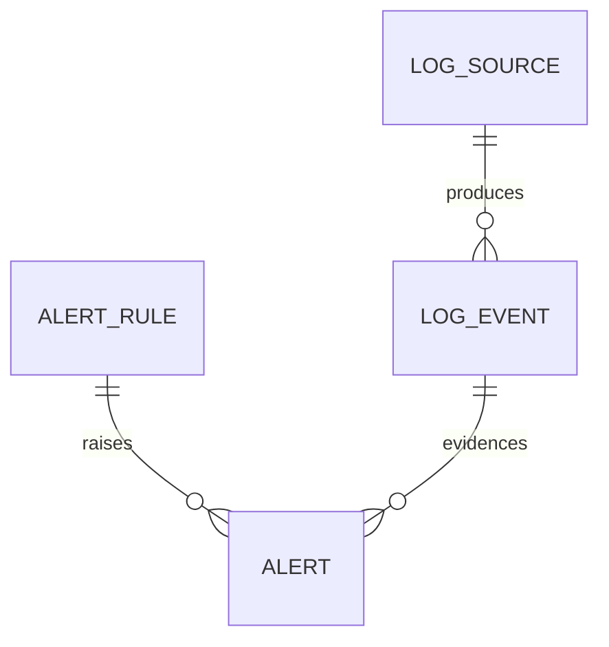

# Architecture

> **Skeleton.** This document describes the target architecture and marks what is already
> in place. Sections tagged **TBD** are decisions that have not been made yet; sections
> tagged **Planned** are decided but not implemented. Nothing here is binding until the
> corresponding PR lands — update this file in the same PR that changes the shape of the
> system.

## Status at a glance

| Area                                    | State       |
|-----------------------------------------|-------------|
| Local dev stack (Postgres/Redis/Redpanda) | Shipped     |
| Backend skeleton, health, OpenAPI         | Shipped     |
| PostgreSQL schema + Panache repositories  | Shipped     |
| Ingestion pipeline (Kafka)                | Planned     |
| Detection (rules + AI)                    | Planned     |
| REST API surface                          | Planned     |
| Frontend application                      | Planned     |
| AuthN/AuthZ (JWT + RBAC)                  | Planned     |
| Log search backend (OpenSearch?)          | TBD         |

## Context

The platform ingests logs from heterogeneous sources, normalises them into a common event
shape, evaluates them against detection rules and AI models, and raises alerts that an
analyst triages through a web UI.

## Component view

### Backend packages

Mirrors `com.siem.analyzer` — see [backend/README.md](../backend/README.md#package-layout).

| Package   | Responsibility                                              |
|-----------|-------------------------------------------------------------|
| `rest`    | HTTP boundary: resources, DTOs, exception mappers            |
| `service` | Business logic; the only layer that orchestrates             |
| `domain`  | JPA entities and domain enums                                |
| `repo`    | Panache repositories — every query lives here                |
| `config`  | Typed `@ConfigMapping` configuration                         |
| `health`  | Custom health checks                                         |

The dependency direction is one-way: `rest → service → repo → domain`. A resource never
touches a repository, and a repository never returns a DTO.

## Data model

Shipped in `V1__init.sql`, Flyway-owned; Hibernate runs in `validate` mode and never emits
DDL.

| Table        | Holds                                                                    |
|--------------|--------------------------------------------------------------------------|
| `log_source` | Registered sources (name, type, configuration)                            |
| `log_event`  | Normalised events; carries the upstream identifier used to drop replays   |
| `alert_rule` | Detection rules                                                           |
| `alert`      | Raised alerts; the rule is nullable — a model-raised alert has none       |

## Runtime flows

**Ingestion (Planned).** Source → Kafka topic → consumer → normalisation → `log_event`.
Deduplication uses the upstream identifier. Ordering guarantees, partitioning key and
retention are **TBD**.

**Detection (Planned).** Rule evaluation over incoming events, plus AI-assisted detection
through LangChain4j and anomaly scoring with Smile. Whether detection runs inline with
ingestion or as a separate consumer is **TBD**.

**Triage (Planned).** The SPA reads alerts and events over REST, an analyst changes an
alert's status, and the transition is audited.

## Cross-cutting concerns

- **AuthN/AuthZ (Planned).** SmallRye JWT, RBAC via `@RolesAllowed`. Token issuer, role
  taxonomy and multi-tenancy are **TBD**.
- **Configuration.** `application.yaml` with MicroProfile Config profiles and typed
  `@ConfigMapping` interfaces. No configuration is read as loose strings.
- **Observability.** Health endpoints under `/q/health` today. Metrics and tracing are
  **TBD**.
- **API contract.** The OpenAPI document generated at `/q/openapi` is the source of truth;
  the frontend client is generated from it, so the contract cannot drift silently.
- **Errors.** Exception mapping and a common error payload shape are **TBD**.

## Decision log

Architecture decisions get one entry each, newest first. Anything marked TBD above becomes
an entry here once decided; substantial ones graduate to an ADR under `docs/adr/`.

| Date | Decision | Rationale |
|------|----------|-----------|
| —    | _No entries yet._ | |

Open questions carried by this document: the search backend (OpenSearch vs. PostgreSQL
full-text), detection placement, ordering and retention on the ingestion topics, tenancy
model, and the error contract.
